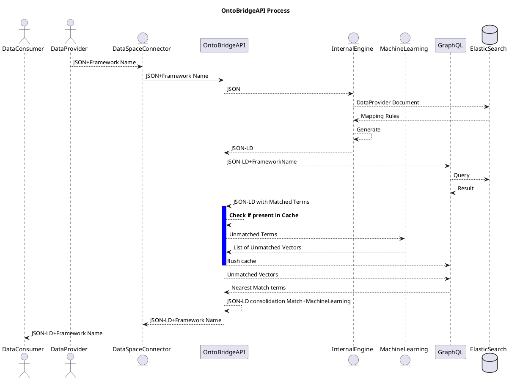

# OntoBridgeAPI

[OntoBridgeAPI Process](https://sequencediagram.org/)



## Install and run with Poetry

We use [Poetry](https://python-poetry.org/) 1.1.11 to manage dependencies and packaging.
If you've never used poetry, install it with **(For Powershell users, you can check the poetry installation instructions [here](https://python-poetry.org/docs/))**:

```bash
curl -sSL https://raw.githubusercontent.com/python-poetry/poetry/master/get-poetry.py | POETRY_VERSION=1.1.11 python -
```

If you had installed poetry before, please ensure you have the correct poetry version (1.1.11) installed in your environment:
```bash
poetry self update 1.1.11 # If `poetry --version` is not 1.1.11
```

Move to `ontobridgeApi` directory
```bash
cd .\services\ontobridgeApi
```

Enable poetry to install the venv at the root of your project dir
```bash
poetry config virtualenvs.in-project true
```

You also need poetry to use your ~3.11 python version. You can check which python poetry is using `poetry env info`.
And if you don't see the right python version please run
```bash
poetry env use /path/to/Python311/python.exe
```

Install your python environment dependencies by running:
```bash
poetry install
```