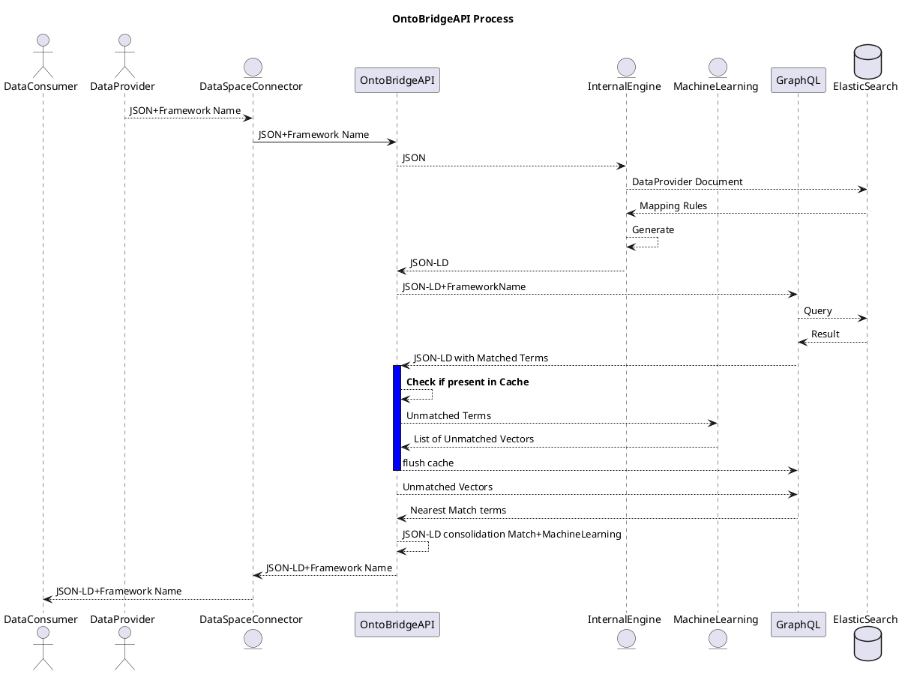

# OntoBridgeAPI

[OntoBridgeAPI Process](https://sequencediagram.org/)



## Install and run with Poetry

We use [Poetry](https://python-poetry.org/) 1.8.4 to manage dependencies and packaging.
If you've never used poetry, install it with **(For Powershell users, you can check the poetry installation instructions [here](https://python-poetry.org/docs/))**:

```bash
pipx install poetry
```

If you had installed poetry before, please ensure you have the correct poetry version (1.8.4) installed in your environment:
```bash
poetry self update 1.8.4 # If `poetry --version` is not 1.8.4
```

Move to `ontobridgeApi` directory
```bash
cd ./services/ontobridgeApi
```

Enable poetry to install the venv at the root of your project dir
```bash
poetry config virtualenvs.in-project true
```

Install your python environment dependencies by running:
```bash
poetry install
```

Remark: the project works with Python ~3.12. If you have different version on you system, you can check which python poetry is using `poetry env info`.
And if you don't see the right python version please run - and then restart the intall -: 
```bash
poetry env use /usr/bin/python3.12
```


## Tests

* on command line : 
    - run all the tests: `poetry run pytest`
    - run a specific test file: `poetry run pytest -v -rs -s tests/transformation_test.py`
    - run a specific test function in a file: `poetry run pytest -v -rs -s tests/transformation_test.py::test_apply_tree_rules_interim`
    - run code coverage : `poetry run pytest --cov --cov-report html:tests/cov-report`. The report is exported as html in the `tests/cov-report` folder


* on vscode: 
    - 1/ add the ontobridgeApi in the vscode folder: `add folder to Workspace...`
    - 2/ add the poetry python interpreter: `Cmd+Shift+p and then type Python Interpreter` -> select `ontobridgeApi` folder and then the Python with `('.venv': Poetry)`
    - 3/ go to `testing` and run the tests

