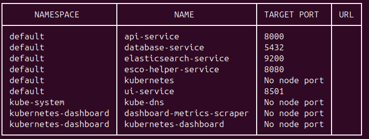
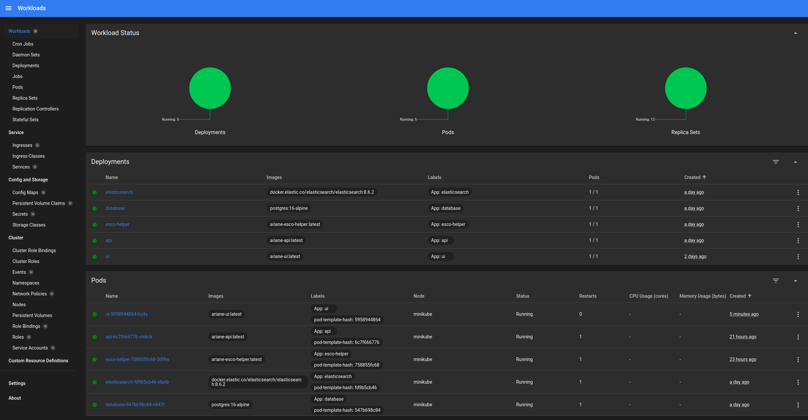

Terraform configurations for the Ariane project infrastructure. 
Run on Minikube.

# Requirements : 
* Docker
* Minikube 
* Kubectl 
* Terraform

# 1/ build image in minikube 
``` bash
# start minikube 
minikube start --driver=docker
# build images inside the minikube repository
eval $(minikube docker-env)
docker compose -f compose.yaml -f compose.prod.yaml build ui
```

# 2/ Deploy the infrastructure 
``` bash
cd terraform/
terraform init
terraform plan
terraform apply
```

# Explore deployed services


## verify images in the minikube's docker registry 

`minikube service list`


`minikube dashboard`


